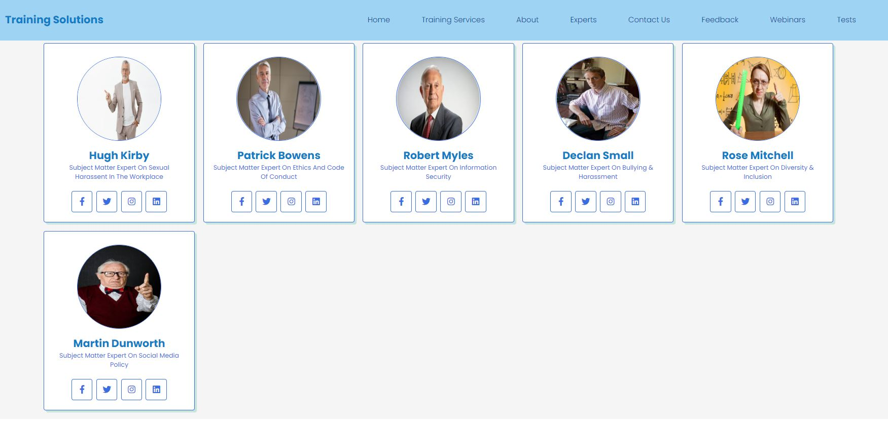

# Training Solutions  

This academic project shows a **Training Consulting's website** that offers Training to companies about **Ethics And Code Of Conduct, Bullying & Harassment, Sexual Harassment, Diversity & Inclusion, Social Media Policy, and Information Security**. The colours, images, and Google Map have been chosen to create a company's image as a business that is committed and working to avoid and/or mitigate work enviroment issues between CEOs, Plant Managers, HR Departments, and Employees. The structure of this project consists of 3 websites as follows:
1. Website: Company presentation, services, customer's feedback, and link to quiz.
2. Website: Quiz Form for users.
3. Website: Quiz online: questions, multiple choices, and results.

Finally, the website's design is aimed to be user friendly and responsive to different devices such as PC deskstop, laptops, tablets, and mobile phones to make a user friendly experience for website visitors.   

Training Solutions!!!Link to see this project live: **[Training Solutions](https://pirzer.github.io/Let-s-playing-and-training/index.html#home)**.  

  

## Contents  

- [User Experience](#user-experience-ux)
- [Features](#features)
- [Technologies Used](#technologies-used)
- [Testing](#testing)
- [Deployment](#deployment)
- [Credits](#credits)  

## User Experience (UX)

- ### User stories

  - ### As a user or potential client/partnership/investor, I expect to navigate and find the following info: 

    -  What does the company consist of? i.e., direct to the point, a brief description of the company service and/or product.

    -  Get familiar with the company's team, and some descriptions of the their projects, customer feedback, and if there is a quiz online it would probably show part of the company resources and tools for customers.

    -  User Friendly way to contact the company and location details in the event of requesting further details for future projects.

-   ### Design
    - #### Colour Code

        -  Due to the company's association to Training Industry, the website's colours are blue, white, transparent, grey, purple, pink, yellow, green, black, transparent, red, and their variance, i.e., 5 types of blues, 2 different whites, 2 greys, 2 yellows, 2 purple, 2 pink, 2 green, transparent, 1 red and black, to sum a total 20 colours.  
        
    - #### Typography

        -  3 types of font-family were used as part of the learning and experiment process of using typography properties in coding.  

    -   #### Imagery
        -   The format of the images is jpg and gif. 

    -   #### User's Profile
        -   As a user looking for solutions for work environments, I expect to view some customer feedback, type of quiz and Subject Matter Experts as is shown already.

## Features

-   To improve user engagement at this website, the use of interactive elements was included. 

-   Responsive approach was applied on different screen sizes such as **PC Desk, Laptop, Tablets, and Mobile Phones**.  

## Technologies Used

   - ### Languages Used

        -   [HTML5](https://en.wikipedia.org/wiki/HTML5)
        -   [CSS](https://en.wikipedia.org/wiki/Cascading_Style_Sheets)
        -   [Javascript](https://en.wikipedia.org/wiki/JavaScript)
    
   - ### Libraries, Frameworks & Software Used

1. [Giphy:](https://giphy.com/)
    - This software online was used to find gif files to provide visual input.  
1. [Bracket:](https://brackets.io/)
    - **Brackets** allowed to see a Live preview of markdown documents - current file -.        
1. [Youtube:](https://www.youtube.com/)
    - **Youtube** website was used to search for information coding-wise.
1. [Amiresponsive](https://ui.dev/amiresponsive?)
    - This website was used as a tool for checking to see how the website looks at different screen sizes. 
1. [W3C](https://validator.w3.org)
    - This was used to assess the **HTML** and **CSS** files.
1. [Jshint](https://jshint.com/)
    - This was used to assess the **Javascript** files.    
1. [GoogleFonts](https://fonts.google.com)
    - The website imports font-family from **GoogleFonts**.
1. [FontAwesome](https://fontawesome.com)
    - The website imports icon from **FontAwesome**.  
1. [Testing](https://testingbot.com/members/manual/340332)
    - This website was used to test this website based on this system for cross-browser **Testing**.
    - Browsers testing:  **Opera**, **Edge**, **FireFox**, and **Chrome**. The website performs satisfactorily as expected. 
1. [Chrome DevTools](https://www.google.com/)
    - The website was tested to make its performance as much responsive as desired.  
1. [GitHub:](https://github.com/)
    - Following repository practice, it was used  **GitHub**.
1. [GitHub Pages](https://pages.github.com)
    - To deploy this website, it was done using **GitHub Pages**.
1. [GitPod](https://www.gitpod.io)
    - The coding was developed using **GitPod** as the cloud-based environment.  

## Testing 
-   The following images show the test results:   
    
    ### Am I responsive. Users can navigate through the websites, and complete the quiz from different devices such as PC Desktop, Laptop, Table, and Mobile. See images below.
-     
-     
-     
-     
-     
-     
-     
-     

    ### Google Chrome "lighhouse" - Test Report - PC Desk - index.html, index_nickname2.html, & index_quiz.html
-   
-    
-    

    ### Google Chrome "lighhouse" - Test Report - Mobile - index.html, index_nickname2.html, & index_quiz.html
-   
-   
-    

    ### Testingbot - Test Report - Mobile
-     

    ### Testingbot - Test Report - Tablet
-   

    ### Testingbot - Test Report - FireFox
-     

    ### Testingbot - Test Report - Opera
-     

    ### Testingbot - Test Report - Edge
-     

## Coding Validation - HTML & CSS
-   The following images show the test results without warnings or error messages:  

    ### HTML - Checker report
-   
-   
-     

    ### CSS - Checker Report 
-     
-     
-     

## Coding Validation - Javascript
-   The results are as follow: 
-    
-    
-     

## Testing scrolling
-   The Website is performing correctly. The scrolling tests done are as follow:

-   Full scroll/down
-   Refresh website
-   All sections show up while the user[s] scroll up/down it.
-   See the following images:  

  
  
  

## Testing hovering
-   The Website is performing correctly. The hovering tests done are as follow:  

-   6 x Images from Our Team section work perfectly.
-   Refresh website
-   See the following images:  
 
  

## Deployment 
-   The following steps were performed to complete the deployment.  
    - Create a New Repository on my **GitHub** account.  
    - Link my **GitPod** and my repository by clicking on the green button of **GitPod** showing in **GitHub**.  
    - Typed the command  `git init` in **GitPod** environment so that I could start my repository. 
    - **GitPod** terminal was used with the intention of adding files, committing, and pushing, using Git version control.  
    - By using the command `git push`, all changes were sent to the remote repository in **GitHub**.
    - My **GitHub** was named, and setting also. The option of Master Branch was selected. 
    - The deployed site is updated automatically when new commits take place.  

## Credits 

### Content 
    - All the information displayed was written by the developer.  

### Source of Images and Video 

        - https://rec.ie/environmental-eng/  
        - https://energynext.co.th/category/news/page/35/   
        - https://www.altenergymag.com/storyfeed/solar-wind/    
        - https://www.greentechmedia.com/articles/read/operations-and-maintenance-the-key-wind-farm-profitability  
        - https://www.youtube.com/watch?v=wpFUAxInzAc  
          

### Code

-   The following websites have been the main support and sources for this project:  

        - https://github.com/codingmarket07/Responsive-Website-Design-  
        - https://github.com/m1key-m/grinders-coffee-house  
        - https://github.com/jdquerales/MilestoneProject_1  
        - https://www.youtube.com/watch?v=j_lo8rvpsh4  
        - https://www.youtube.com/watch?v=j_lo8rvpsh4   
        
        - https://www.learn-codes.net/javascript/javascript-function-for-login-form-submit/#javascript-form-validation
       

### Acknowledgements

-   Tutors online from Code Institute for their helpful input.

